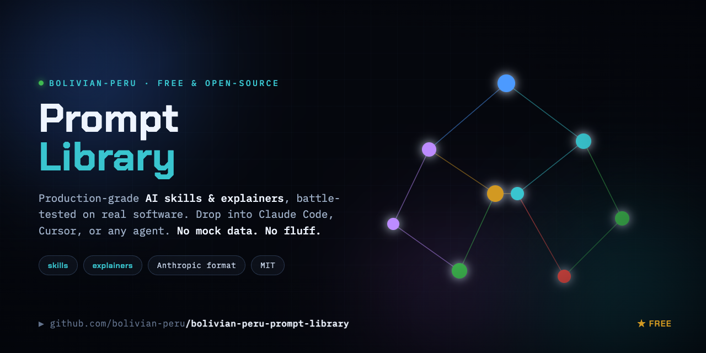

# bolivian-peru prompt library

**Free, production-grade AI skills & explainers — battle-tested on real software, not toy demos.**

---

A growing, open collection of **skills** (reusable AI-agent prompts in the
[Anthropic skill format](https://github.com/anthropics/skills)) and **explainers**.
Each one is something we actually built and shipped — extracted into a portable form so
you can drop it into Claude Code, Cursor, Copilot, or any LLM agent and get the same
result on **your** codebase.

Every skill here follows two non-negotiable principles:

1. **Deep, real analysis — no mock data.** Skills instruct the agent to read your actual
   code/config and verify every claim against a real file. Nothing is invented or
   placeholdered. If a value can't be verified, it isn't shown.
2. **No fluff.** Concrete steps, real code, the hard-won gotchas. Optimized for an agent
   to *execute*, not to read nicely.

---

## Skills

| Skill | What it does |
|---|---|
| [**system-map-visualization**](skills/system-map-visualization/) | Deeply analyzes any codebase, then builds a **live, animated 3D WebGL "system map"** of the whole ecosystem **+ a static PlantUML architecture diagram**, both from one code-verified data file. Real-time telemetry, clickable nodes, guided end-to-end journeys. No backend of its own — one self-contained static HTML file. |
| [**agentic-chat-interface**](skills/agentic-chat-interface/) | Builds a production-grade **streaming agent chat front-end**: SSE-streamed conversation, live tool-call timeline, collapsible "thinking" panel, stop/retry/abort, graceful failure. Framework-light (React + `fetch` + Streams API + Tailwind) — no chat library, no SSE library. Decoupled from any backend by one 10-event SSE contract. |

_More coming. Watch / star the repo._

---

## How to use a skill

Each skill is a folder under [`skills/`](skills/) containing a `SKILL.md` (the prompt) plus
any helper files. Pick whichever path fits your tool:

**Claude Code / Claude Agent SDK** — drop the skill folder into your project's
`.claude/skills/` (or `~/.claude/skills/`). Claude discovers it by the `description:` in the
frontmatter and invokes it when your request matches.

**Cursor / Copilot / Windsurf / any chat** — open the `SKILL.md`, paste its contents into
the chat as context, and add a one-line ask, e.g. _"Follow this skill to build a system map
of THIS repo."_ The agent reads your code and produces the artifacts.

**Plain API** — send the `SKILL.md` body as a system/developer message, then ask the model
to apply it to your repository (give it file access via your tool layer).

> The skills are tool-agnostic. They assume the agent can read files and run shell commands
> in your project. They never require our infrastructure.

---

## Why these exist

These come out of real production work. When something gets solved cleanly enough to
generalize, the reusable core is extracted and published here — free, MIT. Use it, fork it,
ship it. No attribution required.

If a skill saved you time, a ⭐ is appreciated — it tells us which ones to keep investing in.

---

## Contributing

PRs welcome — see [CONTRIBUTING.md](CONTRIBUTING.md). The bar: it must be something real you
shipped, it must analyze real systems (no mock data), and it must be concrete enough that an
agent can execute it end-to-end without hand-holding.

---

## License

MIT © 2026 bolivian-peru — see [LICENSE](LICENSE). Do whatever you want.
